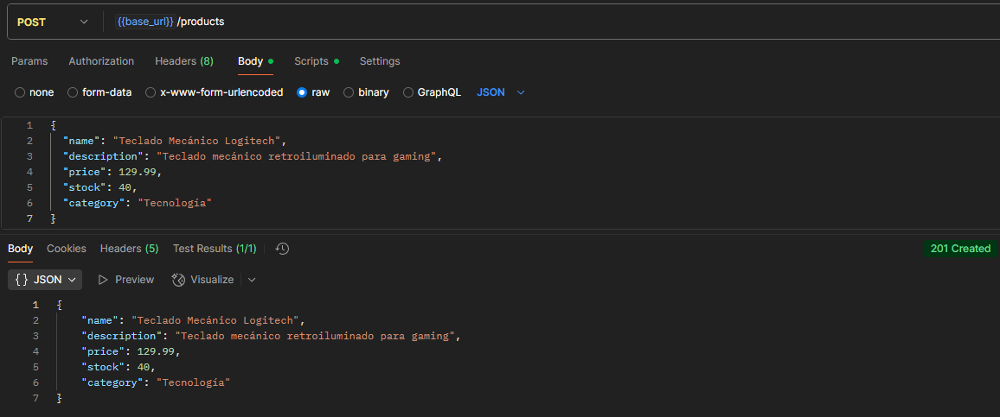
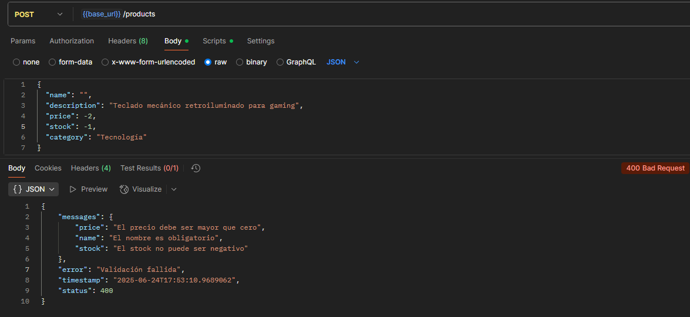
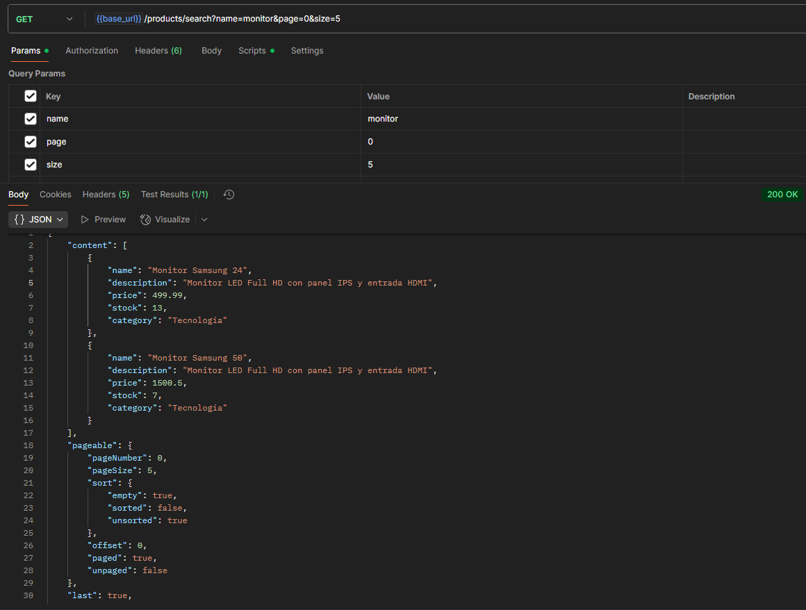
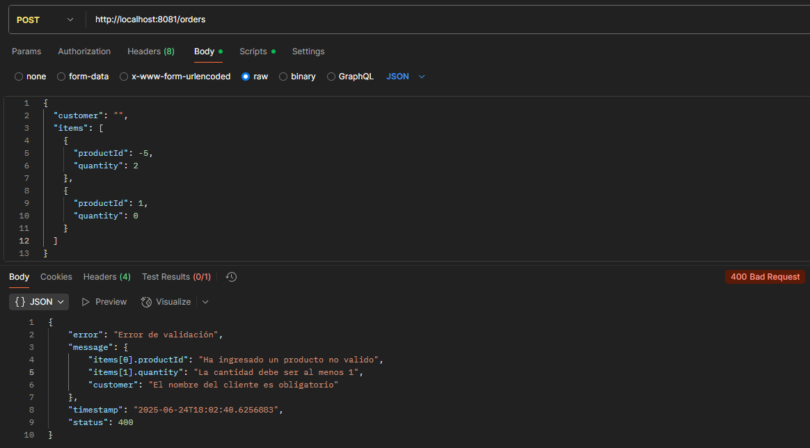
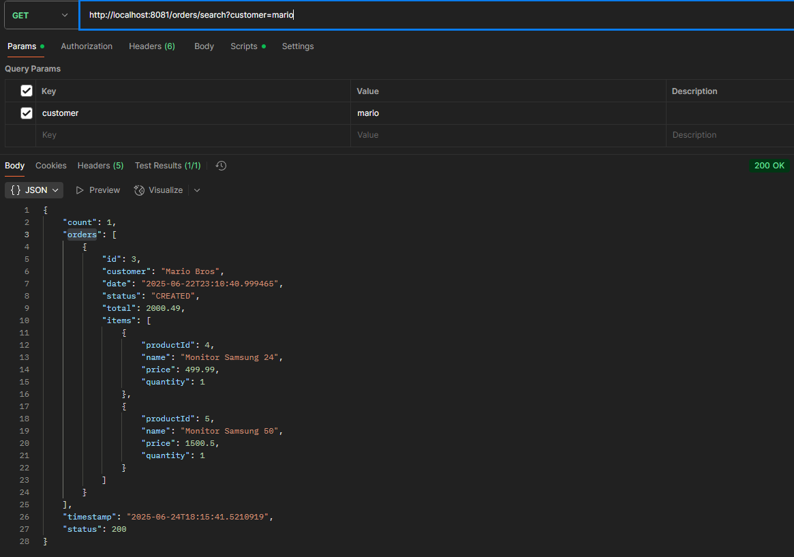
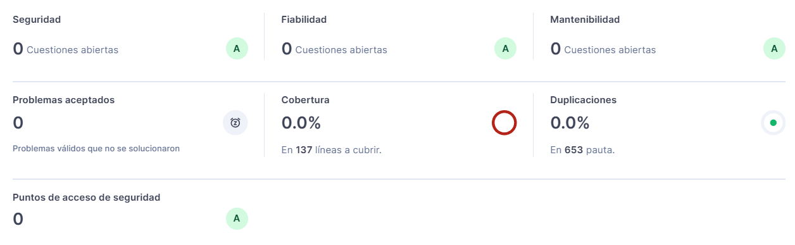

# E-Commerce Microservices: Gestión de Productos y Órdenes de Compra

Este proyecto consiste en dos microservicios desarrollados con **Spring Boot 3.x** que permiten gestionar productos y órdenes de compra de un sistema simple de e-commerce.

## Microservicios

1. **ms-products**  
   - CRUD de productos.
   - Búsqueda por nombre con paginación.
   - Validación y actualización de stock.

2. **ms-orders**  
   - Creación de órdenes con uno o varios productos.
   - Consulta de órdenes por cliente.
   - Integración con ms-products para validar y actualizar stock.
   - Uso de patrón Circuit Breaker con fallback.

---

## Cómo ejecutar el proyecto

### 1. Prerrequisitos

- Java 17+
- Maven
- MySQL
- Postman
- SonarQube (para validación de código)

### 2. Base de datos

Ambos microservicios utilizan **la misma base de datos**: `parcial_db`.  
> Solo necesitas crear una vez:

```sql
CREATE DATABASE parcial_db;
```

### 3. Ejecución de los Microservicios

Puedes ejecutar ambos microservicios de dos formas:

#### Opción 1: Usando la terminal

```bash
# Terminal 1: Iniciar ms-products
cd msproducts
mvn spring-boot:run

# Terminal 2: Iniciar ms-orders
cd msorders
mvn spring-boot:run
```

#### Opción 2: Desde tu IDE

Abre el proyecto y ejecuta directamente la clase `Application.java` de cada microservicio:

- `ms-products/src/main/java/com/msproducts/Application.java`
- `ms-orders/src/main/java/com/msorders/Application.java`

Esto te permite correr cada microservicio de manera independiente desde tu entorno de desarrollo.

---

## Colección Postman

Se incluye una colección de Postman para probar los endpoints principales:  
 `postman_collection.json`

| Método | Servicio     | Endpoint                                      | Descripción                                      |
|--------|--------------|-----------------------------------------------|--------------------------------------------------|
| POST   | ms-products  | `/products`                                   | Crear un nuevo producto                          |
| GET    | ms-products  | `/products/search?name=monitor&page=0&size=5` | Buscar productos por nombre parcial y paginación |
| POST   | ms-orders    | `/orders`                                     | Crear una orden de compra                        |
| GET    | ms-orders    | `/orders/search?customer=kevin`               | Buscar órdenes por cliente                       |

**Creación de producto**


**Validación de creación de producto**


**Listado de productos por nombre parcial y paginados**


**Creación de orden**


**Validación de creación de orden**


**Listado de ordenes por nombre del cliente**


---

## Patrones Aplicados

- **Builder**  
  Aplicado en entidades `Product`, `Order`, `OrderItem`, y en DTOs.

- **Circuit Breaker + Fallback**  
  En `ms-orders`, se utiliza `Resilience4j` en el `ProductClient` para tolerar fallos al consultar el stock en `ms-products`.

---

## Validación de Código con Sonar

El proyecto fue escaneado con **SonarQube**.  
Se corrigieron las siguientes prácticas:

- Eliminación de inyecciones por campo (`@Autowired`) → uso de **constructor injection**.
- Reutilización de cadenas repetidas (como `"timestamp"`).
- Manejo de excepciones genéricas reemplazadas por **custom exceptions** (`InsufficientStockException`, etc).
- Eliminación de parámetros no usados, código no cubierto, etc.

**Reporte SonarQube de los dos microservicios** 


---

## Notas Finales

- El sistema está **modularizado por capas** siguiendo buenas prácticas de arquitectura.
- Todos los endpoints devuelven respuestas HTTP adecuadas y mensajes personalizados.
- Se implementaron validaciones con `@Valid`, `@NotBlank`, `@Min`, etc.
- Se manejan errores con `@ControllerAdvice` y `@ExceptionHandler`.

---

## Autor

> Kevin Benjamin Sosa León

Evalución Parcial - Desarrollo de los Componentes del Negocio
